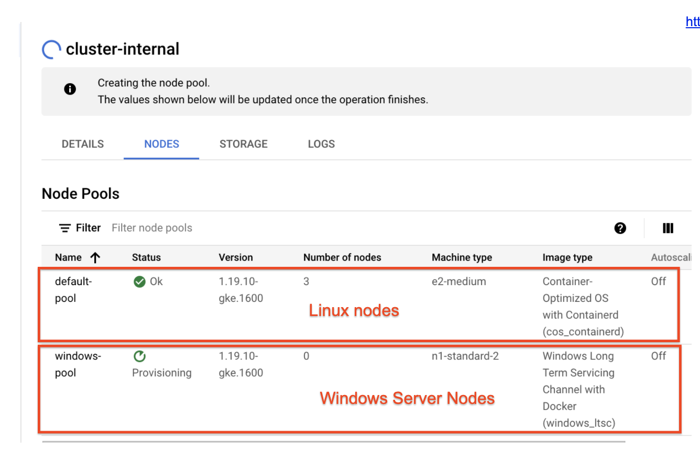
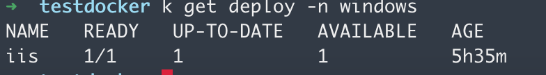
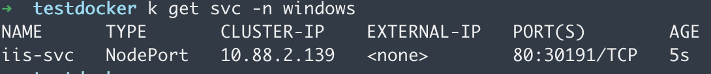
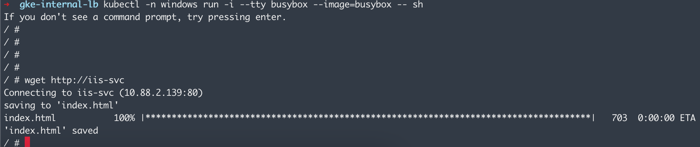
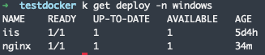
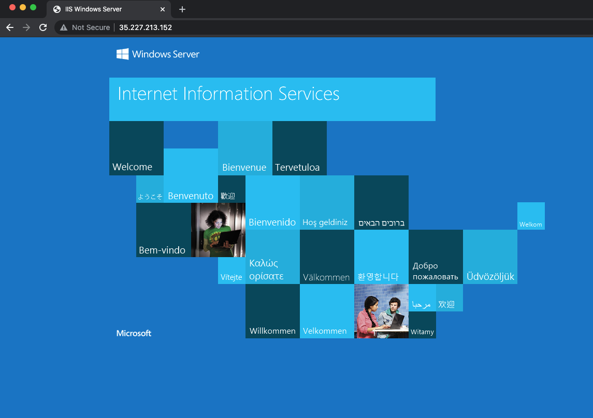

# Windows GKE with Ingress 

[Windows GKE](https://cloud.google.com/kubernetes-engine/docs/concepts/windows-server-gke) is a Kubernetes service offered by Google Cloud for management of containerized workload based on Windows VMs. There are many benefits with running a GKE cluster as opposed to open source Kubernetes cluster mainly around maintainability and patching. One key feature missing from Windows GKE is that [ingrsss] (https://cloud.google.com/kubernetes-engine/docs/concepts/ingress) doesn't currently work out of the box. This guide attemps to show how you can still get the benefits on ingress by deploying an [Nginx](https://www.alibabacloud.com/blog/how-to-use-nginx-as-an-https-forward-proxy-server_595799) forwderer to re-driect traffic. This guide shows you how to take a sample containerized Windows application and forward traffic via a GKE ingress resource running on a linux based node


## Prerequists 

1. Container Registry  
2. Windows GKE nodes
3. Linux GKE nodes


### Set up the GKE cluster

Follow this [guide](https://cloud.google.com/kubernetes-engine/docs/quickstart) on how to stand up a GKE cluster. Once complete, add [Windows Server nodes](https://cloud.google.com/kubernetes-engine/docs/how-to/creating-a-cluster-windows) to the cluster. When complete with the steps above, there should be a single GKE cluster containing both Windows Server and Linux based nodes in their respectibe pools. 



## Deploy containerized application on Windows nodes and expose NodePort Service
 
Follow this  [guide](https://cloud.google.com/kubernetes-engine/docs/how-to/deploying-windows-app#create_a_deployment_manifest_file) on how to deploy a containized application on the Windows Server node created in the previous step. 

To expose the application, run the following command to expose as a NodePort service 
```
   kubectl expose deployment iis --name iis-svc --port 80 --target-port 80 --type NodePort
```

once it's everything is deployed, you will end up with a running pod on a Windows Server node and a NodePort service exposing the deployment 






Validating the service is working and receiving traffic by running a busybox pod on the same namespace and valite that the service `http://iis-svc` is running 

```
   kubectl run -i --tty busybox --image=busybox -- sh
```




## Set up Nginx deployment to forward traffic to deployment

### set a configmap

The Nginx pod will forward as a proxy for traffic to be re-directed to the Windows deployment. Before we do that, we need to set a key/value pair so the Nginx pod knows which service to forward traffic to. To acoomplish that, we use [configmap](https://kubernetes.io/docs/concepts/configuration/configmap/) to pass that value as a environment variable that can be picked up. 

```
   kubectl create configmap windows-service --from-literal=service=iis-svc
```

### Deploy Nginx to forward traffic

You can manually update an Nginx image to foward the traffic to the Windows Server based service. However to make it more dynamic in this example, we will use an updated Nginx image that takes an environment variable as the service. The updated Nginx instance will need a configuration file that forwards all traffic to the Windows Server based service. To accomplish that, we use the example configuartion below. The file can be found under `/etc/nginx/conf.d/frontend.conf.template` for docker image `sapient007/nginx-proxy:test_build_env` as a reference. 

```
   server {
      listen 80;

      location / {
         proxy_pass http://${service_name};
      }
   }

```

the nginx instance needs to be updated to refelct the service name post start. To accomplish this, we must provide the environment variable `service_name` and also a command to do a environment variable substitution post start. below is a deployment manifest for referece. The portion that updates the Nginx instance occurs at the `postStart` event

```
apiVersion: apps/v1
kind: Deployment
metadata:
  name: nginx
  labels:
    app: nginx
spec:
  selector:
    matchLabels:
      app: nginx
  replicas: 1
  template:
    metadata:
      labels:
        app: nginx
    spec:
      containers:
      - name: nginx
        image: "sapient007/nginx-proxy:test_build_env"
        lifecycle:
          postStart:
            exec:
              command:
                - "sh"
                - "-c"
                - |
                  envsubst '${service_name}' < /etc/nginx/conf.d/default.conf.template > /etc/nginx/conf.d/default.conf
                  nginx -s reload
          preStop:
            exec:
              command: ["/usr/sbin/nginx","-s","quit"]
        env:
          - name: service_name
            valueFrom:
              configMapKeyRef:
                name: windows-service
                key: service
```


## create service for Nginx forwarder and Ingress resource 
at this point, you should have 2 working depoyments. One deployments is your Windows Server based deployment and the other being the Nginx deployment that forwards traffic 



once all pods are healthy in the deployment. You can expose the Nginx deployment with a NodePort. 

```
  kubectl expose deploy nginx --name nginx-svc --port 80 --target-port 80 --type NodePort
```

Once the NodePort has been created. You can create an ingress resource to expose the NodePort created previously 

```
   apiVersion: networking.k8s.io/v1beta1
   kind: Ingress
   metadata:
   name: basic-ingress
   spec:
   backend:
      serviceName: nginx-svc
      servicePort: 80
```

takes a minute or 2 for an LB resource in addition to external IP to be created and routeable. To check status and IP of your ingress with

```
  kubectl get ingress
```

Open a browser instance to the IP address once it's available and it should be forwarding all traffic from the Nginx instance to your Windows Server based deployment 


